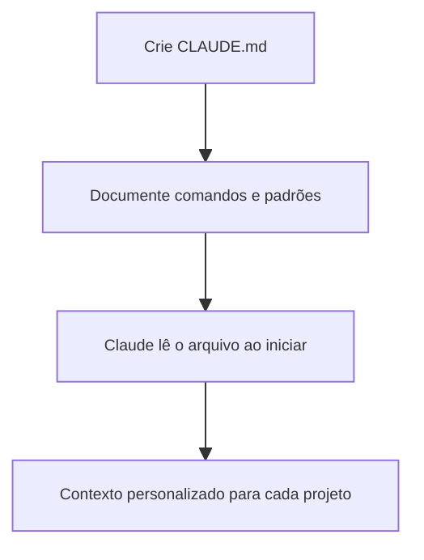

# 📚 Personalização do Ambiente

A personalização do ambiente é fundamental para tirar o máximo proveito do Claude Code. O arquivo `CLAUDE.md` permite documentar comandos, padrões de código, instruções de teste e outras informações importantes para o projeto.

## 📝 Definição

O `CLAUDE.md` é um arquivo especial lido automaticamente pelo Claude Code ao iniciar uma sessão. Ele pode ser colocado na raiz do repositório, em diretórios pais ou filhos, ou até mesmo na pasta pessoal do usuário.

## 🔄 Como Funciona

## 📊 Dicas Principais

- Mantenha o arquivo conciso e objetivo
- Atualize sempre que houver mudanças no fluxo de trabalho
- Use instruções claras e, se necessário, destaque pontos importantes com "IMPORTANTE" ou "VOCÊ DEVE"

## 🔗 Casos de Uso

- [Exemplo de CLAUDE.md](use-case-1.md)
- [Dicas de configuração](use-case-2.md) 