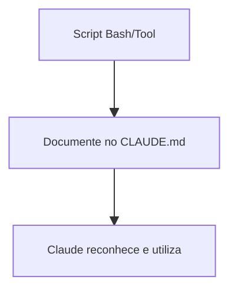

# 🧠 Expansão de Ferramentas

Claude Code pode ser integrado a diversas ferramentas do seu ambiente, como scripts bash, MCP servers e APIs REST. Documentar essas integrações no CLAUDE.md facilita o uso e a automação.

## 📝 Definição

A expansão de ferramentas permite que Claude utilize utilitários personalizados, scripts e integrações externas para ampliar suas capacidades.

## 🔄 Como Funciona

## 📊 Dicas Principais

- Sempre explique o que cada ferramenta faz
- Inclua exemplos de uso
- Atualize o CLAUDE.md ao adicionar novas integrações

## 🔗 Casos de Uso

- [Integração com script bash](use-case-1.md)
- [Uso de MCP server](use-case-2.md) 