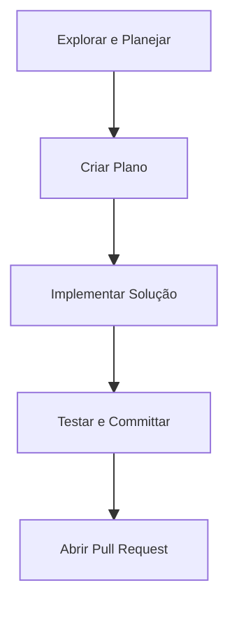

# 📊 Workflows Comuns

Claude Code permite diversos fluxos de trabalho para aumentar a produtividade e a qualidade do código. Abaixo estão os principais workflows recomendados.

## 📝 Definição

Workflows são sequências de passos para resolver problemas, automatizar tarefas e colaborar usando Claude Code.

## 🔄 Exemplos de Workflows

## 📊 Workflows Recomendados

- **Explorar, planejar, codar, commitar**: Ideal para problemas complexos
- **Testes primeiro (TDD)**: Escreva testes antes do código
- **Iteração visual**: Use screenshots e mocks para validar resultados
- **Safe YOLO**: Automatize tarefas repetitivas com segurança

## 🔗 Casos de Uso

- [Workflow de exploração e planejamento](use-case-1.md)
- [Workflow TDD](use-case-2.md) 