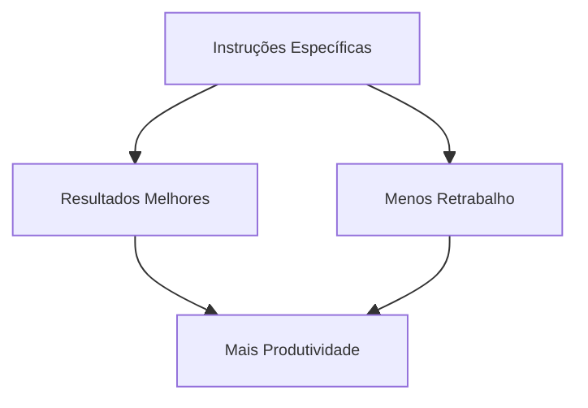

# 💬 Otimização de Fluxo de Trabalho

A eficiência no uso do Claude Code depende de instruções claras, colaboração ativa e uso inteligente das ferramentas disponíveis.

## 📝 Definição

Otimizar o fluxo de trabalho significa adotar práticas que aumentam a produtividade, reduzem erros e facilitam a colaboração.

## 🔄 Dicas de Otimização

## 📊 Dicas Principais

- Seja específico nos prompts
- Use imagens, arquivos e URLs para dar contexto
- Corrija o rumo cedo e frequentemente
- Use checklists e scratchpads para tarefas grandes
- Use /clear para manter o contexto limpo

## 🔗 Casos de Uso

- [Checklist para correção de lint](use-case-1.md)
- [Uso de imagens e arquivos](use-case-2.md) 