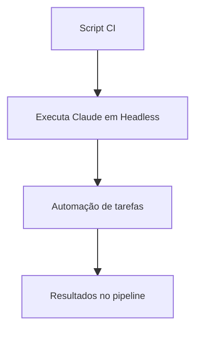

# 👁️ Automação e Headless Mode

O modo headless do Claude Code permite automações em CI, hooks de pré-commit e scripts de build, sem interação manual.

## 📝 Definição

O modo headless executa comandos e fluxos de trabalho automaticamente, ideal para pipelines e integrações contínuas.

## 🔄 Como Funciona

## 📊 Dicas Principais

- Use o flag `-p` para prompts automáticos
- Combine com `--output-format stream-json` para logs estruturados
- Ideal para triagem de issues, linting subjetivo e revisões automáticas

## 🔗 Casos de Uso

- [Automação de triagem de issues](use-case-1.md)
- [Uso como linter subjetivo](use-case-2.md) 