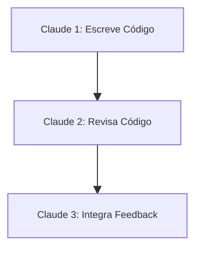

# 🎮 Multi-Claude e Colaboração

Utilizar múltiplas instâncias do Claude Code pode acelerar tarefas, melhorar revisões e aumentar a qualidade do código.

## 📝 Definição

Multi-Claude refere-se ao uso simultâneo de várias sessões do Claude Code, cada uma focada em uma tarefa ou revisão específica.

## 🔄 Estratégias de Colaboração

## 📊 Dicas Principais

- Separe tarefas independentes em diferentes instâncias
- Use worktrees do git para múltiplos ambientes
- Combine revisões cruzadas para maior qualidade

## 🔗 Casos de Uso

- [Revisão cruzada com múltiplos Claude](use-case-1.md)
- [Uso de worktrees para paralelismo](use-case-2.md) 